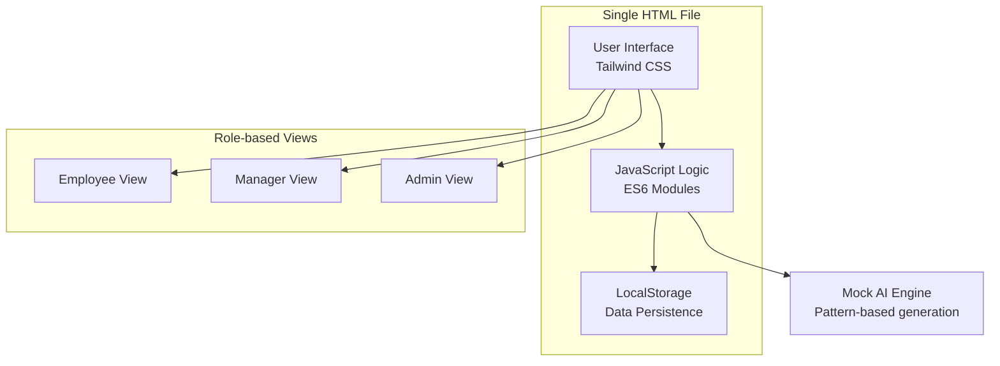

# AI-Powered Performance System - MVP Plan

## Architecture Decision

Given the constraint: **"simple, yet powerful, no dependencies to install"**

### Selected Stack
| Component | Choice | Reason |
|-----------|--------|--------|
| **Frontend** | Single HTML file | No server, no build tools, just open in browser |
| **Styling** | Tailwind CSS (CDN) | No npm install needed, responsive out of box |
| **Data Storage** | LocalStorage | Persists in browser, no server setup |
| **AI Generation** | Mock AI (JavaScript) | No API key needed, instant, free |
| **Icons** | Heroicons (CDN) | Clean, professional look |

### Architecture Overview


## Core Features to Build

### Phase 1: MVP Core Loop
- [ ] **Goal Management**: Admin creates goals, assigns to employees
- [ ] **Progress Submission**: Employee updates goal progress
- [ ] **AI Feedback Generation**: Auto-generate personalized feedback
- [ ] **Empathy Adjustments**: Record life events, adjust ratings fairly
- [ ] **Rating Dashboard**: Show final ratings with adjustments

### Phase 2: Enhancements
- [ ] **AI Recommendations**: Personalized growth suggestions
- [ ] **Team Reports**: Manager sees consolidated team insights
- [ ] **Export/PDF**: Generate performance reports

## Data Model (LocalStorage)

```javascript
// Keys in LocalStorage
performance_system_data = {
  users: [],           // id, name, role, managerId
  goals: [],           // id, title, description, successCriteria, createdBy
  employeeGoals: [],   // id, employeeId, goalId, targetDate, assignedBy
  progressUpdates: [], // id, employeeGoalId, completion, text, date
  aiFeedback: [],      // id, employeeId, goalId, type, text, confidence
  empathyEvents: [],   // id, employeeId, type, startDate, endDate, method
  ratings: []          // id, employeeId, rawScore, adjustedScore, period
}
```

## File Structure

```
performance-system/
├── index.html          # Single file with all UI, CSS, JS
├── SPEC.md             # System specification
└── plans/
    └── architecture.md # This file
```

## Implementation Order

1. **Create SPEC.md** - Document the full specification
2. **Build skeleton** - Basic HTML structure with Tailwind
3. **Implement data layer** - LocalStorage wrapper functions
4. **Build Employee View** - Dashboard, progress submission, AI feedback display
5. **Build Manager View** - Team overview, empathy adjustment, finalization
6. **Build Admin View** - Goal creation, user management
7. **Implement Mock AI** - Pattern-based feedback generation
8. **Implement Empathy Engine** - Life event recording, rating adjustments
9. **Polish & Test** - Ensure responsive, no console errors

## Key UI Components

| Component | Description |
|-----------|-------------|
| `GoalCard` | Shows goal title, progress %, deadline, AI feedback |
| `ProgressForm` | Employee submits update → triggers AI feedback |
| `EmpathyPanel` | Manager records life events, sees adjusted ratings |
| `TeamReport` | AI-generated insights about team performance |
| `RatingBadge` | Shows final rating with adjustment explanation |

## Success Criteria

- Open `index.html` in any browser → system works
- No npm install, no server, no external dependencies (except CDN)
- Employee can submit progress → see AI feedback
- Manager can adjust for life events → see fair ratings
- All data persists across browser sessions

---
*This plan will be executed in Code mode*